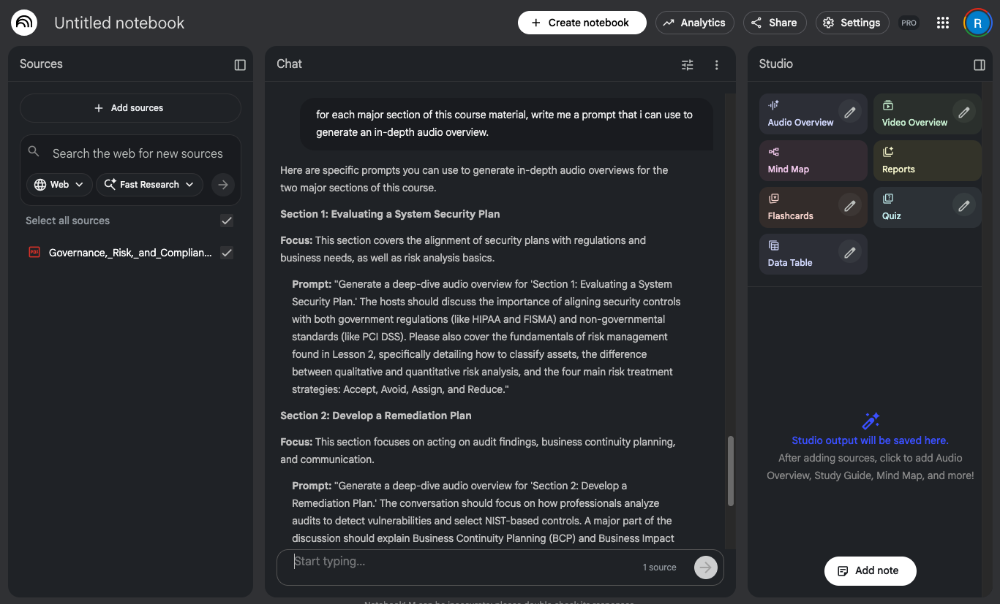
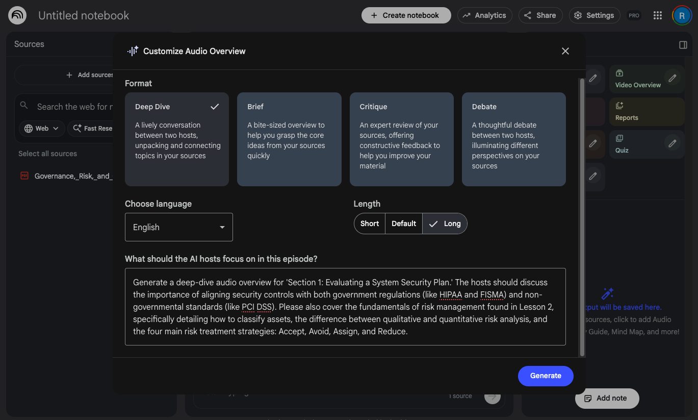

# WGU Course Material to PDF Tool

Log into WGU and generate a PDF of the coursework. This is useful if you're preparing to be without internet and want to study, or to upload to Notebook LM to generate a Podcast or flashcards.

# Setup and Usage

Install the dependencies the first time you download the repo with this command `npm i`, then you can run the script with this command `npm run main`.

# Login Credentials

You can add them to a `.env` files for conveneience, but if you don't it will prompt you interactively for them in the CLI.

Create the `.env` file: `cp .env_example .env`

# Handling MFA

Current version supports MFA via either the text message or the WGU app.

You can also set the `DEFAULT_MFA_METHOD` variable in `.env` to either `app` or `text` to indicate whether you want to use the app or get a text message for your multi-factor authentication method. If you don't set it, or if your preferred method is unavailable you will bhe prompted to choose. If there is only one possible MFA option, it will just use that and you will not be provided a choice. If the "Skip MFA" option is available, it will always choose that, however that option was removed for most people in early February 2026.

# How to Generate a Podcast

After you run the script you should have a PDF file with the same name as the course (e.g., `Governance,_Risk,_and_Compliance_-_D486.pdf`). Upload that file as a source in Notebook LM. 

After providing the course material, I recommend splitting the course material up into several chunks. You can do this simply by asking Gemini how to split the material up. I like to use a prompt like *"for each major section of this course material, write me a prompt that i can use to generate an in-depth audio overview."*

Then, for each of the prompts provided, you'll click on the pencil icon next to the "Audio Overview" and paste the prompt, set it to your preferred duration, etc, and click "generate."

